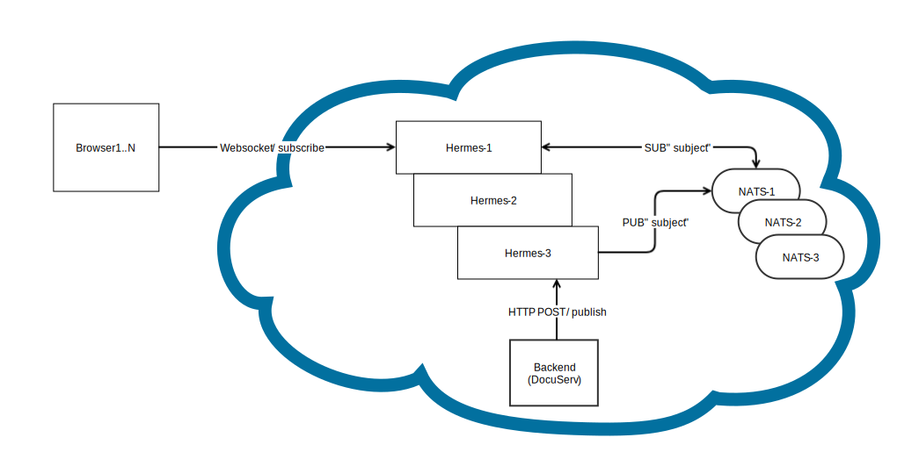

# Hermes

## Purpose
Hermes is an asynchronous pub-sub messaging system that uses the Websocket protocol to talk to its HTTP clients. It's meant to be used as a lightweight self-hosted replacement for Pusher.

## Dependencies
- Websockets: https://github.com/gobwas/ws
- NATS client: https://github.com/nats-io/go-nats

## Design
A NATS server has to run first for Hermes to work. Hermes uses NATS to handle the pub-sub functionality.

Hermes exposes an HTTP server that serves two routes:
- `/subscribe` - clients can use it to initiate a websocket connection via HTTP GET and request subscription to mesages with a given "subject"
- `/publish` - backend services can send messages to it via HTTP POST requests, which contain a query parameter `subj` that specifies the NATS "subject". Subsequently, Hermes will broadcast the received message to the clients that are subscribed to this "subject"

